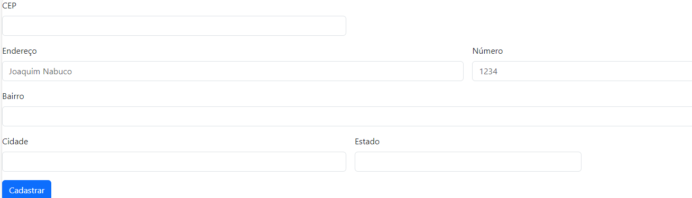

# progeto-CadEndereco
trabalho cadastro de endereço pelo README

# Indice

* [Projeto - Portifólio para escrita do README](#-projeto---portif%C3%B3lio-para-escrita-do-readme)
* [Descrição](#descri%C3%A7%C3%A3o)
* [Funcionalidades](#-funcionalidades)
* [Tecnologia ultilizadas](#%EF%B8%8F-tecnologia-ultilizadas)
* [Fontes consultadas](#-fontes-consultadas)
* [Autores](#%EF%B8%8F-autores)

# 🚀 Projeto - Portifólio para escrita do README

## 📋Descrição 
   

## 🔧 Funcionalidades
* funcionalidade:

### 🛠️ Tecnologia ultilizadas 
* HTML 5
* CSS  3
* JAVASCRIPT

## 📄 Fontes consultadas 

   
          

# https://getbootstrap.com/docs/5.0/getting-started/introduction/

# https://www.alura.com.br/artigos/escrever-bom-readme

## ✒️ Autores
| | [ Maria Eduarda Simões](https://github.com/Mariaeduardasimoes) |  [ Leonardo Rocha](https://github.com/LeonardoRochaMarista) |  [ Marista Escola Social Ir. Acácio](https://github.com/MaristaIrAcacio) |
| :---: | :---: | :---: |

