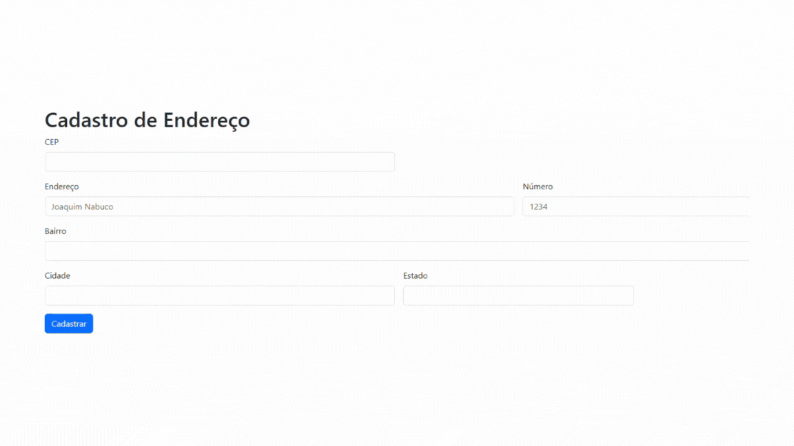
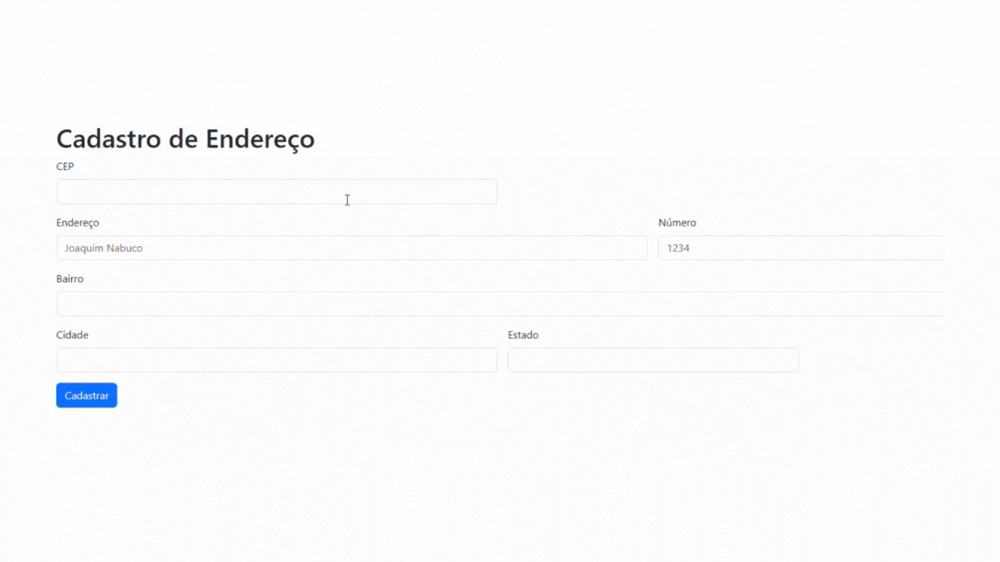
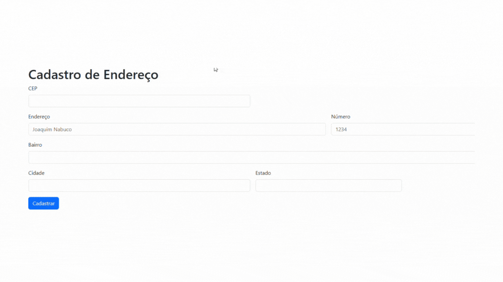

# progeto-CadEndereco
trabalho cadastro de endereço pelo README

# Indice

* [Projeto - Portifólio para escrita do README](#-projeto---portif%C3%B3lio-para-escrita-do-readme)
* [Descrição](#descri%C3%A7%C3%A3o)
* [Funcionalidades](#-funcionalidades)
* [Tecnologia ultilizadas](#%EF%B8%8F-tecnologia-ultilizadas)
* [Fontes consultadas](#-fontes-consultadas)
* [Autores](#%EF%B8%8F-autores)

# 🚀 Projeto - Portifólio para escrita do README

## 📋Descrição 
   

## 🔧 Funcionalidades
* As funcionalidades típicas de uma tela de cadastro de endereço incluem a capacidade de preencher e editar os campos de endereço, validar o formato do CEP, fornecer sugestões de endereço com base no CEP digitado, e permitir salvar ou atualizar os dados de endereço.

* As sua funcionalidade é mostra que quando o campo CEP não for respondido mostrar um compo escrito que está incorreto.

* As sua funcionalidade é mostra que quando o campo CEP não for respondido com o tanto de números certos mostrar um compo escrito que está incorreto.

### 🛠️ Tecnologia ultilizadas 

## 📄 Fontes consultadas 
 
          

## ✒️ Autores
| [ Hanelise Naves Amorim](https://github.com/hiseamorim) |[ Maria Eduarda Simões](https://github.com/Mariaeduardasimoes) |  [ Leonardo Rocha](https://github.com/LeonardoRochaMarista) | [  Marista Escola Social Ir. Acácio](https://github.com/MaristaIrAcacio) |
| :---: | :---: | :---: | :---: |

